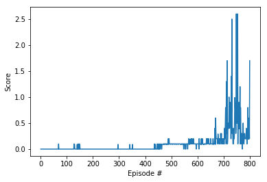

# Project Report

I used the [DDPG](https://arxiv.org/abs/1509.02971) algorithm in a multi agent setting to solve the environment, the sections below will try to describe the internal details of it.

## Model
The DDPG algorithm uses two neural networks, the actor and the critic, here we used two similar neural nets with minor differences. To adapt the ddpg algorithm to a multi-agent setting, we used two instances of the same critic network and each agent will use its own instance, the rest is shared between both agents.

#### The actor NN

The actor is responsible for mapping between states and actions, thus, for a giving state he output the best action.

- Input layer representing the state vector with 8 inputs
- First hidden layer uses 400 nodes
- Second hidden layer have 300 nodes
- Output layer have 2 nodes representing the two possible actions

We used batch normalization at the input layer, RELU activation function for all layer except the output which uses a TANH function to match the action space.

#### The critic NN

The critic is responsible for predicting Q-values, it maps a pair of state and action to the corresponding expected Q-value. As said before, each agent uses its own instance of the critic network.

- Input layer representing the state vector with 8 inputs
- First hidden layer uses 402 nodes (+2 for the action vector)
- Second hidden layer have 300 nodes
- Output layer have 1 nodes representing the Q-value

We used batch normalization at the input layer, RELU activation function for all layer except the output which doesn't uses an activation function since Q-value are values in R.

## Learning Algorithm
The DDPG algorithm will uses a replay buffer which stores observations and uses a random batch at each learning iteration. A learning iteration will train both the critics (the two critic of each agent) and the actor, the critic will learn to predict the exact Q-value for a given state-action pair, the Q-values that the critic predict will then be used to make the actor learn to maximize it, thus, making his actions results in a better score. Below is a pseudocode for the DDPG algorithm

#### DDPG Pseudocode

- initialize the weight of both action network A and critic network C randomly (I used a uniform distribution here)
- initialize the weight of both target action network At and target critic network Ct with the same values as A and C.
- initialize the replay buffer of size BUFFER_SIZE (here 1e6)
- for i_episode in 1..N:
  - get the first state *s_0*
  - for t in 1..T:
    - choose action *a_t* =  A(*s_t*) + noise (the noise for exploration, here I used an Ornstein-Uhlenbeck process)
    - make a step using *a_t* and get reward *r_t* and next state *s_t+1*
    - store the new experience (*s_t*, *a_t*, *r_t*, *s_t+1*) in the replay buffer
    - get a random batch (*s_i*, *a_i*, *r_i*, *s_i+1*) of size BATCH_SIZE (here 1024) from the replay buffer
    - predict next action *a_i+1* = A(*s_i+1*)
    - calculate *y_i* = *r_i* + *discount_factor* x Ct(*s_i+1*, *a_i+1*)
    - update A using the sampled policy gradient
    - update C by minimizing the mean_square_error between *y_i* and C(*s_i*, *a_i*)
    - soft update the target networks At and Ct

#### Hyper Parameters

Here I list the hyper parameters used during learning and mark with a '\*' the ones that I noticed making a big impact on the scores while doing hyper parameters tuning.

- Replay buffer size: 1000000
- Batch size\*: 1024
- Discount factor: 0.99
- Learning rate actor: 0.001
- Learning rate critic: 0.001
- TAU: 0.001
- Ornstein-Uhlenbeck noise
  - Sigma \*: 0.1
  - Theta: 0.15
  - MU: 0

## Results

Below is a plot showing how the agents were performing over time during training. The environment was solved after reaching an average score of +0.5 at the 799th episode.

## Future Improvements

Using DDPG in a multi-agent setting showed a lot of instability and it was hard to find the appropriate hyper parameters to make it keep a high score, introducing noise is what impacted the stability the most for me, tried different values but finally used ones from a previous project that got it to work, but I think I can try to make it stabilize more than what it's doing now.
