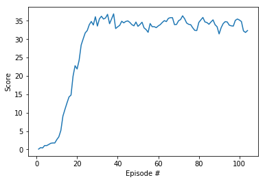

# Project Report

I used the [DDPG](https://arxiv.org/abs/1509.02971) algorithm to solve the environment, the sections below will try to describe the internal details of it.

## Model
The DDPG algorithm uses two neural networks, the actor and the critic, here we used two similar neural nets with minor differences.

#### The actor NN

The actor is responsible for mapping between states and actions, thus, for a giving state he output the best action.

- Input layer representing the state vector with 33 inputs
- First hidden layer uses 400 nodes
- Second hidden layer have 300 nodes
- Output layer have 4 nodes representing the four possible actions

We used batch normalization at the input layer, RELU activation function for all layer except the output which uses a TANH function to match the action space.

#### The critic NN

The critic is responsible for predicting Q-values, it maps a pair of state and action to the corresponding expected Q-value.

- Input layer representing the state vector with 33 inputs
- First hidden layer uses 404 nodes (+4 for the action vector)
- Second hidden layer have 300 nodes
- Output layer have 1 nodes representing the Q-value

We used batch normalization at the input layer, RELU activation function for all layer except the output which doesn't uses an activation function since Q-value are values in R.

## Learning Algorithm
The DDPG algorithm will uses a replay buffer which stores observations and uses a random batch at each learning iteration. A learning iteration will train both the critic and the actor, the critic will learn to predict the exact Q-value for a given state-action pair, the Q-values that the critic predict will then be used to make the actor learn to maximize it, thus, making his actions results in a better score.

Here I list the hyper parameters used during learning and mark with a '\*' the ones that I noticed making a big impact on the scores while doing hyper parameters tuning.

- Replay buffer size: 1000000
- Batch size\*: 1024
- Discount factor: 0.99
- Learning rate actor: 0.001
- Learning rate critic: 0.001
- TAU: 0.001
- Ornstein-Uhlenbeck noise
  - Sigma \*: 0.1
  - Theta: 0.15
  - MU: 0

## Results

Here you can see how the average score was increasing over episodes until solving the environment. You can see how it reached 30 in less than 30 episodes, and was able to keep an average score of around 33. The average score between episodes 4 and 104 was greater than 30 so the environment is considered as solved at episode 4.

## Future Improvements
Other algorithms might be more stable than DDPG, a good start would be to try algorithms like TRPO and PPO.
