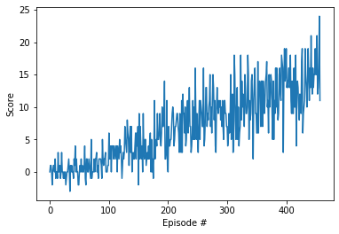

# Project Report

I used the DQN algorithm as described in this [paper](https://storage.googleapis.com/deepmind-media/dqn/DQNNaturePaper.pdf) using a neural network architecture that I describe in the next section.

Due to the limitations of Q-tables (e.g can get really big or infinite for some problems), people have thought of using function estimators instead of Q-tables for estimating the action-values function, deep neural networks are a good candidate as they are nonlinear, however, using a nonlinear function approximator tends to diverge the learning algorithm due to both the correlations found in the sequence of observations and the correlations between the action-values function and the target values, the DQN algorithm solves those two issues by introducing experience replay and the periodic update of target values, the first saves observations on a buffer and uses a random batch at each learning iteration, the second keeps the same target values for a certain number of iterations. The DQN algorithm gave amazing results on a set of different tasks.

## Model
The model is a fully connected neural network with 4 hidden layers:

- Input layer representing the state vector with 37 inputs
- First hidden layer have uses 128 nodes
- Second hidden layer keep 128 nodes as well
- Third hidden layer have 64 nodes
- Fourth hidden layer uses 32 nodes
- Output layer have 4 nodes representing the four possible actions

## Learning Algorithm

As noted before, the algorithm used is DQN, here we list the hyper parameters used during learning

- Replay buffer size: 100000
- Batch size: 64
- Learning rate: 0.0005
- Epsilon: 1
- Epsilon decay rate: 0.995
- Epsilon minimum: 0.01
- Discount factor: 0.99

## Results

Here you can see how the average score was increasing over episodes until solving the environment. You can see how it reached 13 around the 350th episodes, it actually needed 357 episodes to solve the environment.

## Future Improvements

Here I used a vanilla DQN, however, multiple improvements have been proposed over the years that can increase the algorithm performance significantly. A future work would be to implement the combination of extensions as proposed by the [rainbow paper](https://arxiv.org/pdf/1710.02298.pdf).
